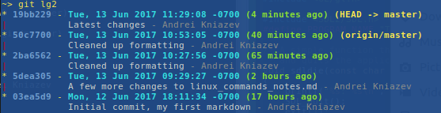
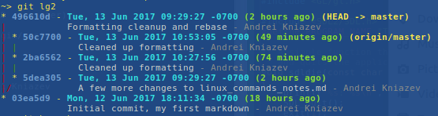
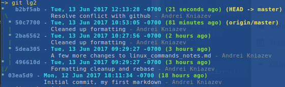

# LINUX COMMAND NOTES

## Overview

This document covers variuos interesting points, specific commands and shortcuts, directory 
layout and file locations in Linux.  The point of this document is make it easier (or
even possible) to recall some information you once came across.

## Bash Highlights

Double quotes expand the variables, single quotes do not

Back tick allows inserting command inside a command:
```
    $ cd /lib/modules/`uname -r`;pwd
        /lib/modules/4.10.0-21-generic
```


### History
Search history for previous command:
`[Ctrl][r]`  -  similar to `[Ctrl][a]` and `[Ctrl][e]` for beginning / end of line
`Enter` will execute the command and `Esc` will add it to the command line rdy for editing.
```
    $ history
    $ !!       # recalls latest command
    $ !1003    # recall command by its number
    $ !-2      # recall second to last command
    $ !cat     # recall latest command matching a starting string
    $ !?search?    # search for a command that contains "search", but doesnt'
        start with it.  i.e. : "apt-cache search"
```
Make substitutions on the latest command:
    `$ ^more^less`

Run another command with the same arguments:
    `$ more !*`

Run another command with just the last one of the arguments:
```
    $ chmod 766 ~/bin/extractTARs  # original command
    $ ls !$:h
```
Can use word designator (:) to select arguments from prev. command:
```
    $ ls /usr/share/doc/manpages
    $ cd !!:1
```
In case where we are operating on the last command, can drop second ! and colon:
    `$ cd !1`

First argument can be refered to as "^" and last as "$".
Ranges can be expressed as (prev command with all args):
```
    $ !!:1*
    $ !!:1-$
    $ !!:*
```

Similarly, can use a number followed by "" to mean everything after specific word should 
be included.

 - "head" (h) can be used to select path leading up to the file (up to the final slash):
```
    $ cat /usr/share/doc/manpages/copyright
    $ cd !!:$:h
    $ pwd
```
 - "tail" is designated by "t":
    `$ less !cat:$:t`
 - "r" strips the trailing extension:
```
    $ tar xzvf long-project-name.tgz
    $ cd !!:$:r
```
or do it twice:
```
    $ tar xzvf long-project-name.tar.gz
    $ cd !!:$:r:r
```
 - "e" removes everything except the trailing extension
 - "p" echos the command instead of executing it (good for checking if substitution is correct):
```
    $ find ~ -name "file1" # original command
    $ !119:0:p / !119:2*:p
    $ find / -name "file1" 
```
It also puts this modified command into history:
   `[CTRL][p]`

Easier substitutions could be done with s/original/new/ syntax:
```
    $ !119:s/~/\//     # substitute first instance, or:
    $ !119:s/~/\//g    # substitute in all occurances
```
To expand a command from history and see what was actually executed use Esc and then CTRL-e:
```
    $ !!   # press Esc, followed by CTRL-e and you get:
    find / -name "swapfile"
```

Move through history:
 -  [Ctrl][p] - previous
 -  [Ctrl][n] - next

Move to the previous folder:
    `$ cd -`

Recalling previous command after you already started typing it:
 -  $ cmd
 -  CTRL-a
 -  CTRL-r
 -  CTRL-y
 -  CTRL-r
 -  or symply: CTRL-aryr

Another command for executing commands from history:
```
    fc -2 0     # Execute last two commands.  It will open those commands in vi for editing
                # and execute them when you exit
```

Alternative editors: nedit, gedit

### Archiving

- z       - gzip
- j       - bzip2
- J       - xz
- --lzma  - lzma
- c       - create
- t       - test
- x       - extract

#### Examples:
```
    $ tar jcvf archive.tar.bz2 dir
    $ tar Jcvf archive.tar.xz dir
    $ tar --lzma -cvf archive.tar.lzma
    $ tar xvf archive.tar.[gz|bz2|lzma|xz]
```
#### Can exclude folders:
```
    $ cd /folder_to_backup
    $ tar czvf /backup/filename.tgz --exclude=folder/sub1 --exclude=folder/sub2 folder 
```
**Note:** `--exclude` statements *MUST* precede the source folder from which we want to exclude selected content.  Excluded folders must not have `~/` (full path works) , just what's
recognizable from the source folder (pattern).  Folder name in the pattern can't have a 
trailing slash: `sys`  not `sys/`.  But `sys/*` would also work.
#### Examples:
```
   $ tar -czvf test.tgz --exclude=work/intrinsyc work | tee testTar.log
   $ tar -czvf test.tgz --exclude=work/intrinsyc ~/work 
   $ tar -czvf test.tgz --exclude=/home/andrei/work/intrinsyc ~/work
   $ tar -czvf test.tgz --exclude=intrinsyc ~/work       // no path, just the name of the folder
   $ tar -czvf test.tgz --exclude='intrinsyc/*' ~/work   // 
```

#### Not:
```
   $ tar -czvf test.tgz --exclude=work/intrinsyc/ ~/work     !!! trailing / after intrinsyc
   $ tar -czvf test.tgz --exclude=~/work/intrinsyc ~/work    !!! ~/ before work
```

Use `--exclude-from=<files2exclude>`    or  `-X <files2exclude>`
Here `<files2exclude>` is a text file containing patterns:
intrinsyc

#### Good example:
    $ for i in 0 1 2; do mkdir -p /tmp/data/sub$i; echo foo > /tmp/data/sub$i/foo; done
    $ find /tmp/data
    /tmp/data
    /tmp/data/sub2
    /tmp/data/sub2/foo
    /tmp/data/sub0
    /tmp/data/sub0/foo
    /tmp/data/sub1
    /tmp/data/sub1/foo
    $ tar -czvf /tmp/_data.tgz --exclude='/tmp/data/sub[1-2]' /tmp/data 
    tar: Removing leading `/' from member names
    /tmp/data/
    /tmp/data/sub0/
    /tmp/data/sub0/foo

## Zip Archives
```
    $ zip -r archive.zip <files>   # create
    $ unzip -t archive.zip         # test / list
    $ unzip archive.zip            # extract
```
Look into rsync (remote sync)!!!

## VIM
Run shell command from inside VIM:
```
:!{cmd}

:! By itself, runs the last external command (from your shell history)
:!! Repeats the last command
:silent !{cmd} Eliminates the need to hit enter after the command is done
:r !{cmd} Puts the output of $cmd into the current buffer
```
Dot character (_`.`_) means "perform last command again", so to comment out several lines in Bash
script you would comment out one, and then go `j.j.j.j.`  

can use a marker for the first line: `ma`     "where a is any letter
then move to the last line and run:  `:'a,. s/^/#/`
This works just like running `s/^/#/` on a visual selection. Here `'a` designates
the mark and `.` designates current line, separated by a comma (,).

### Change font from inside the window
Check what font is being used first:
```
:set guifont?
guifont=Monospace 8
```
Then set it, but make sure to include the slash \
```
:set guifont=Monospace\ 7.5
```

## Bashrc Mods
Assigned (,"), (,//), (,#) and (,;) to create comments (pick one depending on your
language) when visual block is selected.  
To clear the comments select the visual block again and run `,cl`.  It works for all langs.

To search available installation packages use `apt-cache search`, for instance to 
search for "nvidia settins" type:
    $ apt-cache search nvidia settings
The output is:
    nvidia-settings - Werkzeug für die Konfiguration des NVIDIA-Grafiktreibers
    nvidia-settings-updates - Tool of configuring the NVIDIA graphics driver
To find the binary related to the package "nvidia-settings" run:
    $ dpkg -L nvidia-settins | grep bin
The output is:
    /usr/bin
    /usr/lib/nvidia-settings/bin
    /usr/lib/nvidia-settings/bin/nvidia-settings

Use tee command to send standard output to the screen and to the file sumultaneously (fork):
    $ make | tee build.log
    $ make install | tee -a build.log

Fill standard input with always the same string:
    $ yes <string> | <command> # <string> is y by default
examples:
    $ yes | rm -r dir/
    bank> yes no | credit_applicant
    $ yes "" | make oldconfig  # equivalent to hitting "Enter" to accept all default settings

#### View installed packages:
    $ apt list --installed | grep -i mesa

Compressor | Job Time | Time with System Waiting
-----------|----------|-------------------------
gz: |     2.412s |    74,155,976
bz2: |   10.304s |    73,710,049 
xz: |    25.109s |    68,475,888
lzma: |  25.752s |    68.475,888 

To search for files with certain permission:
```
    $ find /path/to/file -user user1 -perm -u+rwx
```
Or using grep to extract all files with superuser bit set:
```
    $ ls /usr/bin | grep '^...s'
```
We can use this grep filter to print only the file names:
```
    $ ls /usr/bin | grep '^...s' | awk '{ print $9 }'
```

#### Makefiles  
Each variable in the Makefile can be overridden from command line.  When SRCS

To fix missing dependencies issue run:
apt --fix-broken install

#### Configure git to properly handle line endings (avoid ^M endings):
```
    $ git config --global core.autocrlf input
```

#### Error installing gvim after building it from source:
```
    $ sudo checkinstall
    dpkg: error processing archive /blah/blah/vim_ddd.dev
    trying to overwrite '/usr/bin/xxd'
    dpkg-dev: error: subprocess paste was killed by signal (Broken pipe)
    Errors were encountered while processing:
    /home/bombadil/tmp/vim/vim_20170611-1_amd64.deb
```

#### Fix it with this command:
    `$ sudo dpkg -i --force-overwrite /home/bombadil/tmp/vim/vim_20170611-1_amd64.deb`
Then check with 
    `$ sudo apt-get -f install`
And reinstall:
    `$ sudo checkinstall`
May be able to install simply with:
    `$ sudo apt install -f  # haven't tried it`
Can remove the package again with:
    `$ dpkg -r vim`

When having problems with Windows endings in a file ( ^M ) open file with vim and run:
    `:set fileformat=unix`
Also can use `dos2unix -n fileName newFileName`

## Apt Commands
 - Search for a package: 
 `apt-cache search mesa | grep OpenGL`
 - View detailed package info:
`apt-cache show [package name]`
 - Get info on OpenGL version:
 `glxinfo | grep "version"`
 - View version info of any package:
 `dpkg -s [package name]`
 `dpkg -s libglu1-mesa`
 - View package dependencies:
 `dpkg -S [package name]`


## Linux Libraries
Headers are located in `/usr/include`
Check out `/usr/include/SDL2`,  `/usr/include/GL`

Dynamic libraries can be found in `/usr/lib/x86_64-linux-gnu`
 - *.a corresponds to archive libraries, which are statically linked with -c flag
 - *.so extensions indicate shared object libraries, which are linked dynamically

Look at:
```
    /usr/lib/x86.../libGLU.a
                    libGLU.so
                    libglut.so
                    libGL.so
```
Compiling and linking can be done this way when `#including <GL/gl.h>` and `<SDL2/SDL.h>`:
```
    $ gcc -Wall -Wextra -pedantic -c sdlGL.c -o sdlGL.o
    $ gcc sdlGL.o -o sdlGLtest1 `sdl-config --libs --cflags` -lm -lGL -lSDL2
    $ ls
    sdlGL.c  sdlGL.o  sdlGLtest1
```

## GIT 

### Merge Commits (Squash)
Rebase interactive (`rebase -i`) can be used to combine several commits into one. Check out a 
tutorial [here](http://gitready.com/advanced/2009/02/10/squashing-commits-with-rebase.html "tutorial").
_It should only be done when noone else has pulled pulled the old commits from the repo!_
- Say you have several minor commits like this:



- To combine four commits into one we could run:
```
    $ git rebase -i HEAD~4
```
- This will open vim window asking to select which commits to squash and which to pick.
_Make sure that vim is configured as the git editor, otherwise it'll tell you it can't save!_:
```
    $ git config --global core.editor "gvim -f"
```
- Now it will open another vim window asking if you want to change the message for this 
combined commit.  Change, save and close.
- If the commits you squashed were already pushed to the repo (but you're sure noone pulled!)
you need to merge them:




```
    $ git pull
    Auto-merging lin_commands_notes.md
    CONFLICT (content): Merge conflict in lin_commands_notes.md
    Automatic merge failed; fix conflicts and then commit the result.

    $ gvim lin_commands_notes.md
    $ git add lin_commands_notes.md
    $ git commit -m "Resolve conflict with github"
    [master b2bf5ab] Resolve conflict with github
```


```
    $ git push origin master
```

## Markdown .md
A very nice page for it [markdownConverters](https://kevin.deldycke.com/2012/01/how-to-generate-pdf-markdown/ "here")
- pandoc - easy, light, intuitive.  Requires additional package (texlive) to print to pdf
```
    $ pandoc README.md -o readme-pandoc.pdf
```
- gimli - written in ruby.  relies on wkhtmltopdf.  
``` 
    $ sudo gem install gimli
    $ gimli -f README.md
```

